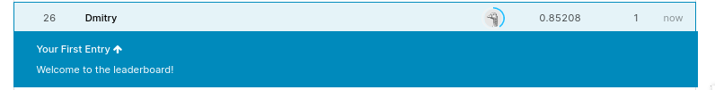
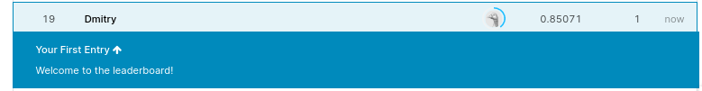
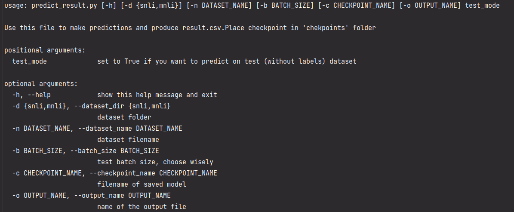
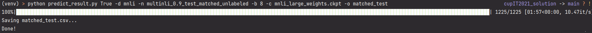

# roBERTa SNLI/MNLI классификатор

## Решение кейса от МТС

Ссылка на веса:

```
https://drive.google.com/file/d/14EWvcg9eMg95UL-H21MvYbE5q8Hh4S61/view?usp=sharing
```

### Результаты

MNLI Matched:


MNLI Mismatched:


## Установка:

Зависимости

```python
pip install -r requirements.txt
```

Данные положить в ``./data/snli/`` и ``./data/mnli/``

Веса положить в ``./data/checkpoints/``

Есть поддержка CLI

```bash
python predict_result.py --help
```



## Краткая справка по структуре

- Классы, отвечающие за данные и их загрузку в модель, находятся в папке ``./data``.
- Модель находится в папке ``./model``.
- В папке ``./utils`` находится скрипт для быстрого сохранения весов модели.

## Получение прогнозов

Для получения прогнозов используется файл ``predict_result.py``. Например, чтобы получить прогноз для matched датасета с
Kaggle нужно выполнить следующую команду:

```
python predict_result.py True -d mnli -n multinli_0.9_test_matched_unlabeled -b 8 -c mnli_large_weights.ckpt -o matched_test
```


